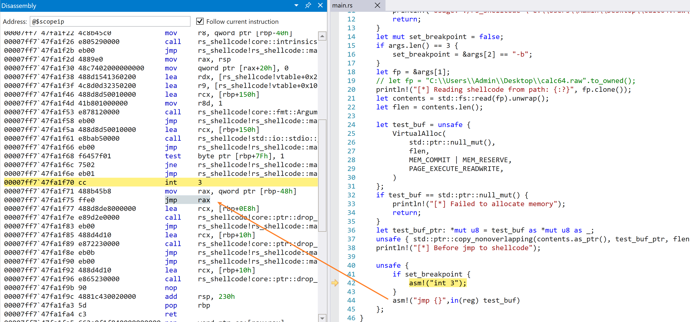

# rs-shellcode

A shellcode runner write in Rust use [windows-rs](https://github.com/microsoft/windows-rs).


# how to use it

Install [rustup](https://rustup.rs/), use nightly toochain.

```sh
rustup default nightly
```

Use msfvenom generate shellcode for test.

```sh
msfvenom -p windows/x64/exec CMD=calc.exe  --platform win -f raw -o calc64.raw
```

Build:

```sh
cargo build
```

Run:

```sh
./target/debug/rs_shellcode.exe <SHELLCODE_PATH>
```

Run with breakpoint flag (`-b`):

```sh
./target/debug/rs_shellcode.exe <SHELLCODE_PATH> -b
```

use this flag, you can break just before your shellcode in the debugger, which will make your life easier.

